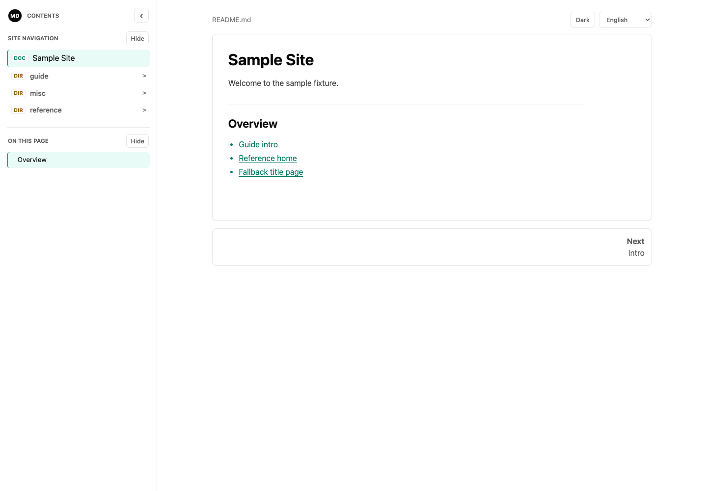
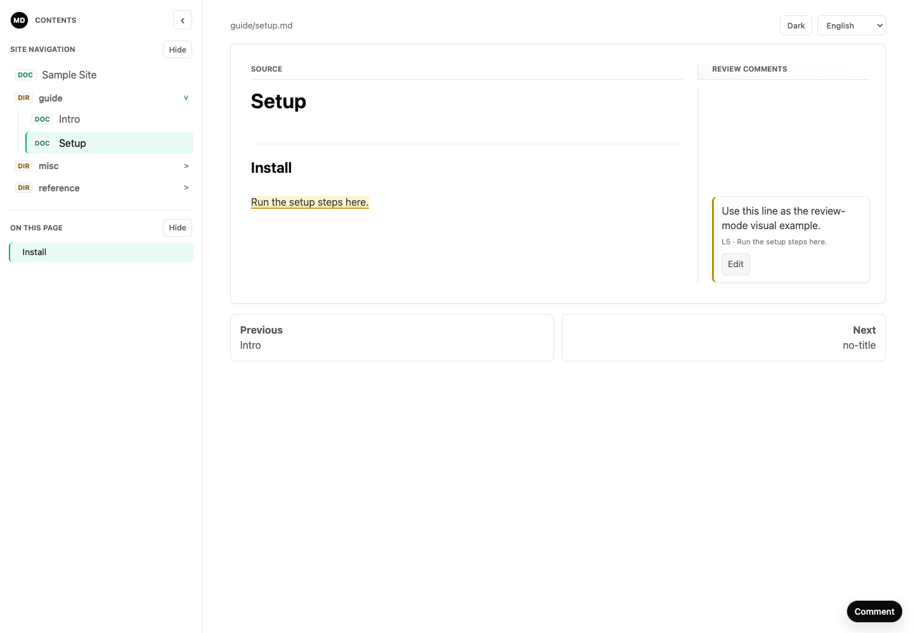

# md-for-human

把 agent 编写的 Markdown 渲染成可导航的静态 HTML 阅读站点。

[English README](README.md)

`md-for-human` 保留 Markdown 作为可编辑源文件，把 HTML 作为阅读产物。它支持目录和单文件输入、侧边栏导航、页面目录、上一页/下一页、本地 Markdown 链接重写、Markdown 与 raw HTML 引用资产复制、代码高亮、结构校验，以及用于 agent 交付的 manifest。

它不会改写、总结或润色 Markdown。

## 安装

当前安装路径：

| 使用场景 | 命令 | 状态 |
| --- | --- | --- |
| 推荐本地使用 | `conda env create -f environment.yml`，然后 `conda activate md-for-human` | 支持从仓库 checkout 使用 |
| 开发安装 | `python -m pip install -e ".[dev]" --no-build-isolation` | 只支持在已激活的 conda 或 virtualenv 中运行 |
| 不激活环境运行 | `conda run -n md-for-human md-for-human ...` | 创建环境后支持 |
| PyPI / pipx / uv tool | `pipx install md-for-human` 或 `uv tool install md-for-human` | 项目发布到 PyPI 前不可用 |

从 checkout 创建并激活项目环境：

```bash
conda env create -f environment.yml
conda activate md-for-human
```

只在已激活的 conda 或 virtualenv 中刷新 editable install：

```bash
python -m pip install -e ".[dev]" --no-build-isolation
```

不要对系统 Python 执行 editable install。

当前 PyPI 项目 URL 返回 404：
<https://pypi.org/pypi/md-for-human/json>。

## 使用

从目录构建并打开结果：

```bash
md-for-human path/to/agent-output
```

从单个 Markdown 文件构建并打开结果：

```bash
md-for-human path/to/notes.md -o /tmp/notes-site
```

不激活环境时运行：

```bash
conda run -n md-for-human md-for-human path/to/agent-output
```

从示例 fixture 构建并验证，但不打开浏览器：

```bash
md-for-human tests/fixtures/sample_site -o /tmp/md-for-human-sample-site --overwrite --verify --no-open
```

验证人类或 agent 写入的审阅标注：

```bash
md-for-human --validate-review /tmp/md-for-human-sample-site
```

构建并启动带源文件热加载的本地浏览器审阅 UI：

```bash
md-for-human path/to/agent-output -o /tmp/md-for-human-review --review --overwrite
```

当 `--review` 构建到已存在的自定义输出目录时，需要加 `--overwrite`。
用 `--review OUTPUT_DIR` 审阅已有生成站点时不会重新构建，也不需要 `--overwrite`。

为已有生成站点启动不带源文件热加载的本地浏览器审阅 UI：

```bash
md-for-human --review /tmp/md-for-human-sample-site
```

`--no-open` 用于 headless 场景，`--verify` 用于结构校验，`--fail-on-warning` 用于严格自动化。agent 交付建议使用 `--strict`，它等价于组合 `--verify --fail-on-warning --no-open`。

## 输出契约

构建成功会输出：

```text
Built site at: ...
Output directory: ...
Pages: ...
Assets copied: ...
Warnings: ...
Browser opened: yes/no
```

使用 `--verify` 时，摘要还会包含 `Verification: passed` 或 `Verification: failed`。

每次构建都会在输出目录写入 `.md-for-human/manifest.json`：

```json
{
  "manifest_schema_version": "mdfh-manifest-v1",
  "tool_name": "md-for-human",
  "tool_version": "0.2.1",
  "entry_page": "index.html",
  "pages": ["index.html", "guide/setup.html"],
  "documents": [
    {
      "page": "index.html",
      "source_path": "README.md",
      "source_line_count": 42,
      "source_sha256": "..."
    },
    {
      "page": "guide/setup.html",
      "source_path": "guide/setup.md",
      "source_line_count": 18,
      "source_sha256": "..."
    }
  ],
  "copied_assets": ["images/diagram.png"],
  "warnings": []
}
```

单文件输入的 `entry_page` 使用源文件 basename，而不是 `index.html`。完整的
manifest 与 review artifact 契约见 [`docs/protocol.md`](docs/protocol.md)。

## Review Artifacts

审阅标注是 `.md-for-human/review/` 下的可选 sidecar artifact，不会修改源
Markdown 或生成的 HTML。`review.md` 是 agent 应先阅读的派生摘要；
`annotations.json` 是需要精确坐标时使用的机器可读事实源。

v2 协议刻意保持很小：每条 annotation 只记录 Markdown 位置和一段自由文本评论。
agent 应把 `source_path + source_range` 作为主定位方式。整页评论使用保留范围
`source_range: {"start_line": 0, "end_line": 0}`。完整字段定义、校验规则和
agent 消费规则见 [`docs/protocol.md`](docs/protocol.md)。

验证审阅 artifact：

```bash
md-for-human --validate-review path/to/output
```

只有在非核心诊断也应让自动化失败时，才加上 `--fail-on-warning`。

当人类需要像批改论文一样做标注时，使用浏览器审阅 UI：

```bash
md-for-human --review path/to/output
```

审阅 server 只绑定 `127.0.0.1`，按请求动态注入审阅 UI，不改写已有生成
HTML。API 路由统一位于 `/__mdfh_review/`，需要 per-session token，不启用
CORS，并且只写 `.md-for-human/review/annotations.json` 和派生的 `review.md`。
review HTML 响应使用基于 nonce 的 Content Security Policy，只允许
md-for-human 自己的 inline script 和 style 执行；Markdown raw HTML 仍会渲染
以便检查，但 raw Markdown scripts、inline event handlers 和 `javascript:`
links 会在 review mode 中被浏览器阻止。普通静态构建不会添加该 CSP。
UI 使用 underline/highlight anchor，以及 inline/unplaced 评论控件。渲染后的
Markdown block 带有 `data-mdfh-source-lines`，浏览器据此保存选中的 Markdown
行号范围。

当被审阅的 Markdown 源发生变化时，旧 source hash 对应的 active comments
会移动到 `.md-for-human/review/archive.json`，并从 active `review.md` 中移除。

## 视觉证据

这些截图由示例 fixture 生成，使用下方开发部分记录的同一个 strict 示例命令。





## Agent Skill

Agent 运行说明在 [`SKILL.md`](SKILL.md)。协议契约在 [`docs/protocol.md`](docs/protocol.md)。`.codex/skills/md-for-human/` 和 `.claude/skills/md-for-human/` 下的入口都指向 `SKILL.md`。

## 开发

标准检查：

```bash
ruff check .
mypy --strict src
python -m pytest -q
python -m md_for_human tests/fixtures/sample_site -o /tmp/md-for-human-sample-site --overwrite --strict
md-for-human --help
```

项目使用 `src/` 布局。顶层 `md_for_human/` 包是 bootstrap shim，让 `python -m md_for_human` 在安装前也能从 checkout 中运行。

## 安全

CLI 会拒绝把输出路径设为输入路径、输入树内部或输入路径祖先。自定义输出路径需要 `--overwrite`。

只复制被引用的本地资产，包括 Markdown 链接/图片和 raw HTML `href`/`src` 目标。缺失、symlink、越过输入根目录或非文件资产会产生 warning。

普通静态 HTML 输出是可信本地内容，不是 HTML sanitizer。不要打开由不可信
Markdown 生成的站点，除非使用 review mode 或外部 sandbox。

## License

MIT. See [LICENSE](LICENSE).
